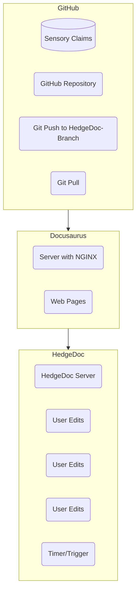

# documentation-toolchain
A documentation toolchain which enables you to collaboratively edit documents and schemas through the use of hedgedoc.

## How it works




## Config.json

Before starting, you are required to setup the config.json
```json
{
  "TITLE": "@Docusaurus",
  "TAGLINE": "Description of project",
  "DOCUSAURUS_URL": "https://your-docusaurus-site.example.com",
  "PROJECT_NAME": "Docusaurus",
  "HEDGEDOC_SERVER": "https://hedgedoc.nqminds.com",
  "GITHUB_OWNER": "nqminds",
  "GITHUB_REPO": "documentation-toolchain"
}
```

- `TTILE`: This is the title of your Docusaurus site (and the name of the exported PDF of docusaurus)
- `TAGLINE`: This is the tagline of your docusaurus site
- `DOCUSAURUS_URL`: The URL you are planning to host the docusaurus site
- `PROJECT_NAME`: Should take the format of `@nqminds/<name>`
- `HEDGEDOC_SERVER`: NquiringMinds' Hedgedoc server for collaborative edits.
- `GITHUB_OWNER`: Owner of the GITHUB repository (would typically be nqminds)
- `GITHUB_REPO`: Name of the GITHUB repository

## Hedgedoc

Hedgedoc only checks for files in the `default branch`, so if your changes aren't pushed to this branc, they cannot be edited collaboratively.
Hedgedoc updates are created as a PR, so keep your eye out for them.

The hedgedoc server can host serveral docusaurus sites. 


## Continous Deployment

In order to get this to work, edit the `deploy.yaml` file at `/github/workflows/deploy.yaml`.

The below example shows the deployment whenever there is a push to the main branch
```yaml
on:
  push:
    branches:
      - main
```
### Setup github secrets:

| Key name               | description                                                |
| ---------------------- | ---------------------------------------------------------- |
| DEPLOY_KEY             | Private SSH  key for server                                |
| REMOTE_SERVER_HOST     | SSH host (name or IP)                                      |
| REMOTE_SERVER_PORT     | SSH Port number                                            |
| REMOTE_SERVER_USERNAME | SSH username                                               |
| REMOTE_SERVER_FOLDER   | Folder name for `/build` files to be placed in `/var/www/` |


NOTE: You may be required to run the following on the remote server

```bash
sudo chown -R user:group /var/www/***/
sudo chmod -R 755 /var/www/***/

```

### NGINX

Create the config:

`<your_config_file>.conf` in `/etc/nginx/sites-available/`

with template:
```nginx
server {
    listen 3000;
    listen [::]:3000;

    server_name <name>.nqminds.com;

    location / {
        root /var/www/<name>;
        index index.html;
        try_files $uri $uri/ /index.html;
    }
}
```

then create a symbolic link:
```bash
sudo ln -s /etc/nginx/sites-available/your_config_file /etc/nginx/sites-enabled/
```

test the configuration:
```bash
sudo nginx -t
```

restart nginx
```bash
sudo service nginx restart
```

