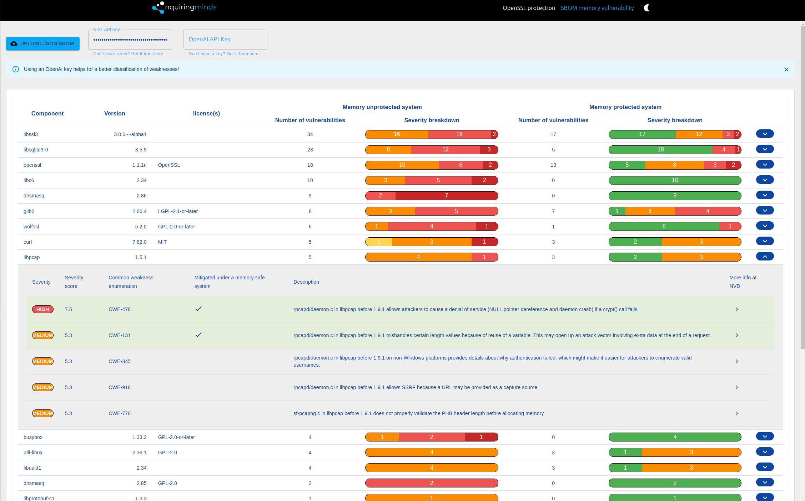

# SBOM-GAP(Generation and Analysis Platform) tool

* For documentation and how to contribute, please follow this [link](https://sbom-gap.nqminds.com/cli/).

## Available commands: 

* [-help](#help)
* [-getCpes](#getcpes)
* [-generateCCPPReport](#generateccppreport)
* [-listCpeDetails](#listcpedetails)
* [-getCves](#getcves)
* [-writeCves](#writecves)
* [-getHistoricalCpes](#gethistoricalcpes)
* [-getHistoricalCves](#gethistoricalcves)
* [-getCweInfo](#getcweinfo)
* [-listVulnerabilities](#listvunlerabilities)
* [-generateSbom](#generatesbom)
* [-generateConan](#generateconan)
* [-genDependencies](#gendependencies)
* [-mapCpes](#mapcpes)
* [-generateCSbom](#generatecsbom)
* [-getGhsa](#getghsa)
* [-extractGhsas](#extractghsas)
* [-classifyCwe](#classifycwe)
* [-getHistory](#gethistory)
* [-generateDockerSbom](#generatedockersbom)
* [-addCpe](#addcpe)
* [-binwalk](#binwalk)
* [-compare](#compare)
---

### Clone the repository

```sh
git clone https://github.com/nqminds/SBOM-GAP.git
```

---

### Download the vulnerability-reports folder and place it in SBOM-GAP module:

- vulnerability-reports directory can be downloaded from [here](https://drive.google.com/file/d/1ZV302sOZXYu7JUiM5fVgrMi3lYxGw1VH/view?usp=drive_link). This also contains all the (National Vulnerability Database)[NVD](https://nvd.nist.gov/) CPE/CWE data. (recommended)

### Download the cpe2.3 database

- Cpe2.3 database [link](https://drive.google.com/file/d/12xd1ze7x7QB7GCNTpzyDGp9BOK52OlG7/view?usp=sharing)
- Unzip this and add it to data/


---

### Ensure node and npm are installed.

```sh
# please use node v16
node --version
V16.16.0

# recommended
npm --version
8.11.0
```

### Install [docker](https://www.docker.com/get-started/) and [docker-compose](https://docs.docker.com/compose/install/) on your machine

---

### Add current user to the docker group

```sh
sudo usermod -aG docker $USER
```

---

### Make Docker Conmpose executable

```sh
sudo chmod +x /usr/local/bin/docker-compose
```

---

### Install all dependencies and pull the necessary docker images

```sh
npm install
```

---
If, after running `npm install`, you do not see a list of Docker containers like the following when running `docker ps -a`:
```sh
vboxuser@testbinwaLlk:~$ docker ps -a

CONTAINER ID    IMAGE                         COMMAND                    CREATED             STATUS           PORTS  NAMES

5a2541bb6992    sbom-gap-nqmvul                "python ./ccscanner/.."    2 days ago          Exited (2)       2 days ago  sbom-gap-nqmvul-1

717bb93ecc87    ionutngm/depscanner:latest    "python ./ccscanner/.."    2 days ago          Exited (1)       2 days ago  sbom-gap-ccscanner-1

6bb149d9d68e    anchore/grype                   "/grype"                  2 days ago          Exited (1)       2 days ago  sbom-gap-grype-1

4442271050da    anchore/syft                    "/syft"                   2 days ago          Exited (1)       2 days ago  sbom-gap-syft-1

4d9869d9be3a    ionutngm/binwalk_v4:latest    "binwalk"                  2 days ago          Exited (1)       2 days ago  sbom-gap-binwalk-1

```
This could indicate that the Docker Compose version on your system differs from the expected version, or that the container images haven't been downloaded. To resolve this, you can try the following:
1. Check Docker and Docker Compose Installation: Ensure Docker and Docker Compose are installed and functioning correctly. Run `docker --version` and `docker-compose --version` or `docker compose version` to verify their versions.

2. Run Docker Compose with Root Permissions: If you suspect permission issues, you can run the following command to ensure all containers are started:

```sh
sudo docker compose up -d
```
or
```sh
sudo docker-compose up -d
```

---
### Create a global symlink to nqmvul tool

```sh
npm link
```

### Download the Git Advisory Database from [here](https://github.com/github/advisory-database) and replace this path in SBOM-GAP/config/config.json with your local advisory-database/advisories.

```json
{
  "gitAdvisoryDbPath": "/path/to/advisory-database/advisories"
}
```

The above is necessary only for getting information about GHSA vulnerability codes. No need to download this data in order to generate an SBOM.

---

### For speeding NIST API requests an API key cen be obtained from [here](https://nvd.nist.gov/developers/request-an-api-key). Please create a .env file in the root directory and add the key as:

```yaml
NIST_API_KEY=your_NIST_api_key
```

---

### To improve the classification of weaknesses, include an OpenAi API key to the global .env. An API key can be obtain from [here](https://platform.openai.com/api-keys):

```yaml
OPENAI_API_KEY=your_OpenAi_api_key
```

---

## -generateSbom
### To generate a Software Bill Of Materials (SBOM) for the ecosystems bellow use the command (Uses [syft](https://github.com/anchore/syft) and [grype](https://github.com/anchore/grype)):

```sh
nqmvul -generateSbom <project_path> <project_name>
```

- Alpine (apk)
- C (conan)
- C++ (conan)
- Dart (pubs)
- Debian (dpkg)
- Dotnet (deps.json)
- Objective-C (cocoapods)
- Elixir (mix)
- Erlang (rebar3)
- Go (go.mod, Go binaries)
- Haskell (cabal, stack)
- Java (jar, ear, war, par, sar, nar, native-image)
- JavaScript (npm, yarn)
- Jenkins Plugins (jpi, hpi)
- Linux kernel archives (vmlinz)
- Linux kernel modules (ko)
- Nix (outputs in /nix/store)
- PHP (composer)
- Python (wheel, egg, poetry, requirements.txt)
- Red Hat (rpm)
- Ruby (gem)
- Rust (cargo.lock)
- Swift (cocoapods, swift-package-manager)

---

<br>

### -generateCCPPReport

### To generate a Software Bill Of Materials (SBOM) for other C/C++ ecosystems (Uses [ccscanner](https://github.com/lkpsg/ccscanner) and [grype](https://github.com/anchore/grype)).

```sh
nqmvul -generateCCPPReport <path_to_c/cpp_project> <project_name>
```

### Package Managers:

- Deb
- Conan
- Vcpkg
- Clib
- CPM
- Buckaroo
- Dds
- Hunter
- Cppget
- Xrepo
- Gitsubmodule
- Pkg-config

### Build Systems

- Make
- CMake
- Autoconf
- Bazel
- Meson
- MSBuild
- Xmake
- Build2
- Buck

---

### After generating a Software Bill Of Material (SBOM) use the [visualization tool](http://sbom.nqminds.com/) for a more detailed representation. <span style="color: yellow;">Only CycloneDx json format is supported.</span>



---


## Help

```sh
nqmvul -help
```

<br>

## getCpes

* The `-getCpes` flag will parse an SBOM and return a list of CPEs in the 2.3 format.

```sh
nqmvul -getCpes <absolute_path_to_sbom.json>
```
To save the cpe to a file use:

```sh
nqmvul -getCpes <absolute_path_to_sbom.json> <filename>
```

<br>

## listCpeDetails

* The `-listCpeDetails` flag will parse an SBOM and return detailed information about each CPE, such as CVEs and CWEs

```sh
nqmvul -listCpeDetails <path_to_sbom.json>
```

<br>

## getCves

* The `-getCves` will return the known CVEs and CWS for a CPE. The CPE must be in CPE2.3 format e.g. `cpe:2.3:\a:\busybox:busybox:1.33.2`

```sh
nqmvul -getCves <CPE>
```

<br>

## writeCVEs

* The `-writeCVEs` flag will write all the CVE data of an sbom into a json format to output_directory/cveData.json

```sh
nqmvul -writeCves <path_to_sbom.json> <path_to_output_directory>
```

<br>

## getHistoricalCpes

* The `-getHistoricalCpes` flag will return all known versions of the input CPE. The CPE must be in CPE2.3 format e.g. `cpe:2.3:\a:\busybox:busybox:1.33.2`

```sh
nqmvul -getHistoricalCpes <CPE>
```

<br>

## getHistoricalCves

* The `-getHistoricalCves` flag will return all known versions of the input CVE. Supported CVE format: `CVE-2022-48174`

```sh
nqmvul -getHistoricalCves <CVE>
```

<br>

## getCweInfo

* The `-getCweInfo` flag will return information such as description for each CWE. Can take one or more CWEs. If multiple CWEs are passed, they must be writen without any space e.g. `CWE-476,CWE-681`

```sh
nqmvul -getCweInfo <CWE,CWE,...>
```

<br>

## generateSbom

* The `-generateSbom` flag will generate an SBOM and a vulnerability report for a project. SBOM is saved to `/vulnerability-reports/sboms/project_name`.json. Vulnerability report is saved to `/vulnerability-reports/reports/vulnerability-report-project_name`.

```sh
nqmvul -generateSbom <project_path> <project_name>
```

<br>

## listVunlerabilities

* The `-listVunlerabilities` flag will list all vulnerabilities previously detected by [grype](https://github.com/anchore/grype/blob/main/README.md)

```sh
nqmvul -listVulnerabilities <path_to_vulnerability_report>
```

<br>


## genDependencies

* To extract all dependencies from a file system, use the `-genDependencies` flag. **Used exclusively with C/C++ file systems**.

- The first argument `<cpp_project>` should represent the path to any C/C++ project you wish to scan.
- The `<project_name> `is utilised to save the extracted dependency list as `/vulnerability-reports/ccsDependencies/project_name_dependencies`.

```sh
nqmvul -genDependencies <cpp_project> <project_name>
```

<br>

## generateConan

* The `-generateConan` flag will generate a `conanfile.txt` for that project. `ccsDependencies/project_name_dependencies` must exist before running this command. The dependency file is created by using the `-genDependencies` flag.

```sh
nqmvul -generateConan <project_name>
```

<br>

## mapCpes

*The `-mapCpes` will create a list of known cpes for each dependency in `/vulnerability-reports/ccsDependencies/project_name_dependencies` and save them to `vulnerability-reports/cpes/cpeMapping.json`.

```sh
nqmvul -mapCpes <project_name>
```

<br>

## generateCSbom

* The `-generateCSbom` flag can be used to generate an SBOM **only for C/C++** projects that are not supported by syft, e.g. C/C++ projects that are not using the CONAN package manager. It takes two arguments, the project name and format(only json or xml). Please ensure that /`vulnerability-reports/conan-files/<project_name>/conanfile.txt` and `/vulnerability-reports/cpe_data.csv` exists before running the command.

```sh
nqmvul -generateCSbom <project_name> <sbom_type>
```

<br>

## getGhsa

* The `-getGhsa` flag will return detailed information about a known GHSA vulnerability. Please ensure the GHSA vul is valid and matches the following format e.g `GHSA-j8xg-fqg3-53r7`.

```sh
nqmvul -getGhsa <GHSA-vulnerability>
```

<br>

## extractGhsas

* The `-extractGhsas` will return an array of GHSA codes. Before running this command please replace the `gitAdvisoryDbPath` path from `config.json` with your local `advisory-database/advisories` path.

```sh
nqmvul -extractGhsas <path_to_vulnerability_report>
```

<br>

## classifyCwe

* The `-classifyCwe` flag will try and classify the CWE_ID as one of the following types: not-memory-related, other-memory-related, spatial-memory-related, temporal-memory-related. Please ensure the CWE_ID is valid and of the following form: e.g. 354. If the CWE_ID doesn't exist in the current database it will return "not found".

```sh
nqmvul -classifyCwe <CWE-ID>
```

<br>

## getHistory

* The `-getHistory` flag will return all `previous` versions of a CPE and for each version will try and find known CVEs and CWEs (vulnerabilities). It also classifies each CWE into memory related issues or other. Can take as an argument various types of CPEs such as: `cpe:2.3:\a:\busybox:busybox:1.33.2`, `cpe:/a:doxygen:doxygen:1.7.2`. For cpes that contain trailing ':_' please place them inside quotes. e.g. : `nqmvul -getHistory "cpe:2.3:a:openssl:openssl:1.1.1:_:_:_:_:_:_:_"`. Output is saved to`output/output.txt`

```sh
nqmvul -getHistory <CPE>
```
To check the info of only once cpe use the `false` flag

```sh
nqmvul -getHistory <CPE> false
```

<br>

## generateCCPPReport

* The `-generateCCPPReport` can be used to scan any type of C/C++ project. Running this command will combine some of the previous tools in order to produce an sbom and a vulnerability report.

```sh
nqmvul -generateCCPPReport <path_to_c/cpp_project> <project_name>
```

<br>

## generateDockerSbom

* The `-generateDockerSbom` command employs [Syft](https://github.com/anchore/syft) to first generate an SBOM (Software Bill of Materials) for the specified Docker image (<image_name>). Following the SBOM creation, it uses [Grype](https://github.com/anchore/grype) to analyze the identified components for vulnerabilities, producing a comprehensive vulnerability report. e.g.`-generateDockerSbom nginx:latest nginx`

```sh
nqmvul -generateDockerSbom <image_name> <project_name>
```

<br>

## addCpe
* The `-addCpe` command allows a manual insertion off a CPE 2.3 to an CycloneDX json type SBOM. e.g. `nqmvul -addCpe /path/to/sbom "cpe:2.3:a:postgresql:postgresql:9.6.2:*:*:*:*:*:*:*"`


```sh
nqmvul -addCpe <path_to_sbom.json> <CPE>
```

<br>

## binwalk

* The `nqmvul -binwalk` command requires specific arguments to function correctly. Here is the general syntax to follow:

```sh
nqmvul -binwalk <directory_path> "[-binwalk_flags]" <file_name>
```
* For more detailed documentation and advanced usage examples, please visit the [Binwalk GitHub repository](https://github.com/ReFirmLabs/binwalk).

`<directory_path>`: This is the path to the directory containing the firmware file you wish to analyze.

`"[-binwalk_flags]"`: These are the flags you want to pass to Binwalk, enclosed in square brackets and quoted. This allows for passing multiple flags as a single argument.

`<file_name>`: The name of the firmware file to be analyzed.

## Examples

Here’s how you can use the command on a `Linux` system where you want to apply the `-Me` flag (for recursive extraction) to a specific firmware file:
```sh
nqmvul -binwalk "$(pwd)" "[-Me]" openwrt-23.05.3-mediatek-filogic-acer_predator-w6-initramfs-kernel.bin

```
This command tells `nqmvul` to run Binwalk in the current directory `"$(pwd)"`, use the `-Me` flag for recursive extraction, and process the specified .bin file.

## Example with multiple flags

If you want to use multiple flags with Binwalk, such as `-M` for matryoshka (recursive) scanning and `-e` for extraction, you would format your command as follows:

```sh
nqmvul -binwalk /path/to/current/directory "[-M -e]" your_firmware_file.bin
```

This setup directs `nqmvul` to execute Binwalk with both the `-M` and `-e` flags on `your_firmware_file.bin` located at the specified path.

## Important Notes

* Ensure the path to the directory and the file name are correctly specified.
* Always enclose Binwalk flags within square brackets and quotes "[]" to ensure they are parsed correctly as a single argument by the script.
* Verify that your Docker container has access to the directory where the file resides, as Docker might have restrictions based on your system’s Docker configuration.

## compare

The `-compare` command compares components, versions, and vulnerabilities across multiple `CycloneDX` `JSON` SBOMs. It helps to visualize differences and similarities between the SBOMs, making it easier to identify discrepancies in components, versions, and vulnerabilities. This command takes multiple paths to SBOM files as arguments and generates a comprehensive report comparing them.

#### Usage
```sh
nqmvul -compare <absolute/path/to/sbom1> <absolute/path/to/sbom2> <additional SBOM paths...>
```
The output will be saved by default to `vulnerability-reports/comparisons/comparison-result.txt`

If you want to specify a different file name to be saved, please use the following format:

```sh
nqmvul -compare "[<absolute/path/to/sbom-1.json> <absolute/path/to/sbom-2.json> <additional SBOM paths...>]" filename
```
#### Output:
The output is structured in three sections:

* `Components Comparison`: Displays which components are present or missing across the SBOMs.
* `Version Information`: Shows the version information of the components found in the SBOMs.
* `Vulnerabilities`: Lists the vulnerabilities associated with the components in each SBOM, detailing the CVEs.

# Testing

### Run all tests

```sh
npm run test
```

### Run individual tests

```sh
npm run test -- nqmvul-help.test.mjs
```

### Run eslint

```sh
npm run lint
```